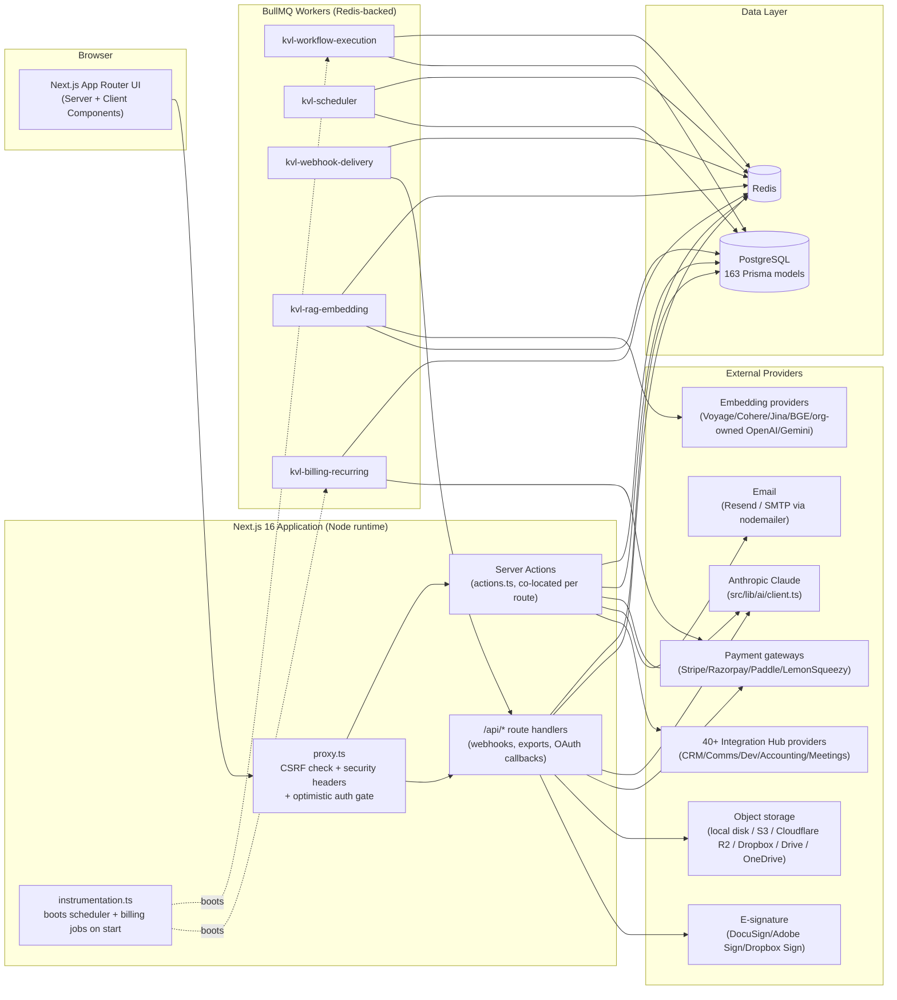

# KVL GrowthOS — System Architecture

> Written from a direct read of the repository as of this build's "production readiness" phase (18 prior feature phases plus this final security/monitoring/QA phase). Every claim below is sourced from a real file in this tree; file paths are cited inline.

## 1. What this is

KVL GrowthOS is a multi-tenant, AI-native enterprise SaaS platform built on **Next.js 16.2.10** (`package.json`) with the **App Router**, **React 19.2.4**, **Prisma 7.8** against **PostgreSQL**, **BullMQ 5** on **Redis** for background work, and **Anthropic Claude** as its single LLM reasoning engine. The Prisma schema (`prisma/schema.prisma`) currently defines **163 models**, spanning Auth, CRM, Outreach, Proposals, Project Management, a separate Client Portal auth system, Analytics/Forecasting, an Integration Hub with 40+ provider adapters, Automation Workflows, a Knowledge Base + RAG engine, AI Agent Memory, and a full Subscription/Billing/White-Label/Reseller platform layer.

The product is explicitly built around a **"never fake an external integration"** discipline: every AI call, payment gateway, OAuth provider, and embedding provider exposes an `isConfigured()`/`isAIConnected()`-style gate, and every UI surface honestly shows "Not Connected" rather than simulating success. This is described further in `docs/guides/developer-guide.md`.

## 2. Next.js App Router structure

The app lives entirely under `src/app/`, with top-level route groups:

- `src/app/dashboard/` — the primary internal, organization-scoped application (CRM, Outreach, Proposals, Projects, Analytics, Settings, Automation, Knowledge Base, AI Command Center, etc.)
- `src/app/admin/` — platform-operator-only, cross-tenant tools: `admin/billing`, `admin/partners`, `admin/payouts` (see §7 and `docs/guides/admin-manual.md`)
- `src/app/board/` — the AI Executive Board surface
- `src/app/portal/` — the Client Portal, with its **own** independent auth system (see §3)
- `src/app/company/`, `src/app/profile/`, `src/app/onboarding/`, `src/app/login/`, `src/app/register/`, `src/app/invite/`, `src/app/forgot-password/`, `src/app/reset-password/`, `src/app/verify-email/` — account lifecycle pages
- `src/app/api/` — REST-style route handlers for webhooks, exports, OAuth callbacks, and API-key-gated integrations (full inventory in `docs/api/api-reference.md`)
- `src/proxy.ts` — Next 16's replacement for `middleware.ts` (the file/export convention changed in this version — see the comment block at the top of that file citing `node_modules/next/dist/docs/01-app/03-api-reference/03-file-conventions/proxy.md`). It performs an optimistic JWT-cookie auth pre-filter for `/profile`, `/company`, `/onboarding`, a same-origin CSRF check for non-GET `/api/*` requests, and applies real security headers (CSP, `X-Frame-Options: DENY`, HSTS in production, etc.) to every response.
- `src/instrumentation.ts` — the Next 16 instrumentation hook; bootstraps the Scheduler Service, the Platform Billing Engine's recurring jobs, and seeds the Plan catalog / core feature flags once per server process (see §5 and `docs/guides/deployment-guide.md`).

### Server Actions as the primary mutation pattern

This codebase overwhelmingly uses **Server Actions** (`"use server"` functions), not a separate REST layer, for data mutation from pages. A repo-wide grep found **97 files** containing the `"use server"` directive under `src/`. The convention is consistent: a route folder such as `src/app/dashboard/settings/jobs/` co-locates:

- `page.tsx` — the Server Component that fetches data directly (e.g. `await scheduler.listStatuses()`, `await getQueueStats()` in `src/app/dashboard/settings/jobs/page.tsx`)
- `actions.ts` — the `"use server"` mutation functions the page's client islands call (`runJobNow`, `pauseJob`, `resumeJob`, `retryFailedJobAction`, `discardFailedJobAction`)
- `_components/` — private, route-scoped client components (e.g. `_components/cron-editor.tsx`)
- `_lib/` — private, route-scoped helpers not meant to be imported outside that route subtree (e.g. `src/app/dashboard/_lib/require-membership.ts`)

The hand-written `src/app/api/*` REST routes exist specifically where a **non-browser caller** needs access: webhook receivers (payment gateways, e-signature providers, transactional email), OAuth `connect`/`callback` redirects, bulk CSV/Excel/PDF exports usable by API key, tracking pixels, and one public API-key-triggered workflow endpoint. Server Actions get free same-origin CSRF protection from the framework itself (Next checks the `Origin` header on every Server Action POST); the hand-written `/api/*` routes do not get this for free, which is why `src/proxy.ts` adds an explicit origin check for them.

## 3. Multi-tenant model

The tenant boundary is the **`Organization`** model (`prisma/schema.prisma`, `model Organization` at line 306). A user's relationship to an organization is a **`Membership`** row (`model Membership`, line 465), unique on `(userId, organizationId)`, carrying a `MembershipRole` enum (line 279):

```
OWNER, ADMIN, MANAGER, SALES, MARKETING, DEVELOPER, SUPPORT, FINANCE, HR, VIEWER, AI_AGENT
```

and a `MembershipStatus` (`INVITED | ACTIVE | SUSPENDED`). A user can hold memberships in multiple organizations; the active one is resolved per-request by `requireActiveMembership()` (`src/app/dashboard/_lib/require-membership.ts`), which:

1. Requires a signed-in session (`redirect("/login")` otherwise).
2. Loads every `ACTIVE` membership for the user.
3. Redirects to `/onboarding` if there are none.
4. Honors an `activeOrgId` cookie (set by the workspace switcher) if it matches one of the user's own memberships, else falls back to the earliest-joined membership.

Nearly every `/dashboard/*` Server Component and Server Action calls `requireActiveMembership()` first and then scopes every Prisma query by `organizationId` — this is the RBAC/tenant-isolation backbone of the whole app. Invitations to join an org are modeled separately (`model Invitation`, line 483) with their own `InvitationStatus` (`PENDING | ACCEPTED | EXPIRED | REVOKED`) and expiry.

A second, **entirely separate** auth boundary exists for **`User.isPlatformOwner`** (`prisma/schema.prisma` line 55) — the platform *operator* role, gated by `requirePlatformOwner()` (`src/lib/billing/platform-admin.ts`). This flag is deliberately not settable through any organization-scoped UI; see `docs/guides/admin-manual.md` for the real SQL used to grant it.

A **third**, fully independent auth system exists for the Client Portal: `ClientPortalUser` is anchored to `Client` (not to a specific Project), with its own opaque-token session cookie and its own guard (`src/lib/client-portal/auth.ts`), deliberately isolated from the internal Auth.js/`User`/`Membership` stack so the same portal auth pattern can be reused for future white-label surfaces without schema changes.

## 4. AI architecture

### 4.1 Primary reasoning engine

All LLM reasoning in this app goes through a single client: `src/lib/ai/client.ts`, wrapping `@anthropic-ai/sdk`. Its contract:

- `isAIConnected()` — returns `true` only if `ANTHROPIC_API_KEY` is set. Every AI-backed feature checks this first.
- `getAnthropicClient()` — throws `AINotConnectedError` if not configured; otherwise lazily constructs and caches a singleton `Anthropic` client.
- `AIBillingError` / `isAIBillingError()` — distinguishes "no key configured" from "key configured but Anthropic account has insufficient credit" (detected via `Anthropic.BadRequestError` + a `"credit balance is too low"` message match), so the UI can show an accurate, distinct message for each failure mode.
- `AGENT_MODEL = "claude-opus-4-8"` — the one model constant every agent-reasoning call site imports; there is no per-feature model sprawl.

Every AI-driven subsystem (AI Executive Board, AI Command Center, Outreach draft generation, RAG answer generation, document ingestion/OCR) imports this one client rather than instantiating its own — a single point of configuration, error handling, and (per `docs/guides/security-guide.md`) credential storage.

### 4.2 Pluggable embedding providers

Unlike the single-provider Claude client, **embeddings** are pluggable per organization: `src/lib/rag/embeddings.ts` resolves a real, org-owned `IntegrationConnection` (via `src/lib/integrations/connection-store.ts`) for whichever embedding provider (`VOYAGE_AI`, `COHERE`, `JINA_EMBEDDINGS`, `BGE`, or an org's own `OPENAI`/`GOOGLE_GEMINI` key) that organization has connected, rather than a single platform-wide API key. `EmbeddingsNotConnectedError` is thrown — never a fabricated zero-vector — when nothing is connected for that org.

### 4.3 RAG pipeline (`src/lib/rag/`)

The pipeline is a straightforward, honestly-degrading chain:

1. **`ingestion.ts`** — real text extraction per format (HTML via `cheerio`, spreadsheets via `xlsx`, archives via `jszip`, images via Claude's own vision input rather than a second OCR dependency — deliberately reusing the one AI connection instead of introducing a differently-configured second one).
2. **`chunking.ts`** — token-aware chunking using `gpt-tokenizer`'s real BPE encoder (not a character-count approximation), splitting on paragraph boundaries first, with configurable overlap so no fact is lost across a chunk boundary.
3. **`embedding-queue.ts`** — a dedicated BullMQ queue (`kvl-rag-embedding`) that chunks, embeds, and upserts vectors asynchronously so ingestion never blocks a request.
4. **`vector-store.ts`** — every embedding is written to a real `Embedding.vector Float[]` Postgres column; retrieval is brute-force cosine similarity over that column by default. A documented, optional upgrade path exists to a native `pgvector` extension (`prisma/optional-pgvector-upgrade.sql`) for ANN-speed search at scale, but nothing in the app requires it to function correctly today — it's a pure performance path.
5. **`retrieval.ts`** — the single hybrid-retrieval read path shared by Enterprise Search, the Context Engine, and AI Memory recall: real semantic search when an embedding provider is connected for the org, falling back to a Prisma `contains` keyword search (mirroring `src/lib/search.ts`) when it isn't.
6. **`generation.ts`** — RAG answer generation with a "never fabricate" contract: answers are grounded only in real retrieved context, citations point at real source rows, and `confidenceScore` is derived from real retrieval scores rather than an LLM's self-reported confidence. When retrieval finds nothing, an honest "no verified knowledge" response is returned without ever calling Claude.

## 5. Background job / queue architecture

Grepping `new Queue(` across `src/lib/` turns up **5 real, independent BullMQ queues**, each with its own globalThis-cached Redis connections (to avoid leaking connections across Next.js dev-mode hot reloads):

| Queue name (string) | File | Purpose |
|---|---|---|
| `kvl-workflow-execution` | `src/lib/workflows/engine.ts` | Executes Automation Workflow runs (the workflow engine itself) |
| `kvl-scheduler` | `src/lib/scheduler/providers/bullmq-provider.ts` | The generic Scheduler Service's cron-style recurring/one-off job runner, backing the Dead Letter Queue UI at `/dashboard/settings/jobs` |
| `kvl-webhook-delivery` | `src/lib/workflows/webhook-delivery-queue.ts` | Delivers outbound workflow webhooks with retry |
| `kvl-rag-embedding` | `src/lib/rag/embedding-queue.ts` | Async document chunking + embedding for the RAG pipeline (kept separate so a re-embedding burst never competes with workflow/scheduler concurrency slots) |
| `kvl-billing-recurring` | `src/lib/billing/recurring-billing-queue.ts` | Platform billing's recurring jobs: `renewal-sweep`, `trial-reminder`, `dunning`, `credit-reset` |

`kvl-billing-recurring`'s own code comment notes it deliberately copies the workflow engine's connection-caching scaffold rather than reusing the generic Scheduler abstraction, "per this phase's scope" — i.e., it is an intentionally separate, fifth queue rather than a job registered on the `kvl-scheduler` queue.

All 5 queues are registered lazily and idempotently; `src/instrumentation.ts`'s `register()` hook is what actually calls `initScheduler()` and `registerRecurringBillingJobs()` once per server process on boot (see `docs/guides/deployment-guide.md` §"Instrumentation bootstrap").

## 6. Multi-provider integration architecture (`src/lib/integrations/`)

`src/lib/integrations/types.ts` defines a single `IntegrationAdapter` contract implemented by every one of the **40+ files under `src/lib/integrations/providers/`** (Slack, HubSpot, Salesforce, Zoho CRM/Books, Pipedrive, Freshsales, Google Drive/Gmail/Calendar/Meet, Microsoft Outlook/Calendar/Teams, DocuSign/Adobe Sign/Dropbox Sign, Stripe/Razorpay/PayPal/Paddle/LemonSqueezy, QuickBooks/Xero, Zoom, GitHub/GitLab/Bitbucket/Vercel/Netlify/Cloudflare, OpenAI/Gemini/DeepSeek/Groq/OpenRouter/Ollama, and the embedding providers Voyage/Cohere/Jina/BGE). Two auth shapes are supported uniformly:

- **`OAUTH2`** — a real 3-legged consent flow (`getAuthUrl`/`handleCallback`/`refreshAccessToken`), driven through `src/app/api/integrations/[provider]/connect/route.ts` and `.../callback/route.ts`.
- **`API_KEY`** — a credential-entry form that calls `connectWithCredentials()` and only persists the credential once a real verification call to the provider has actually succeeded.

Business code never imports a concrete provider file directly — only `src/lib/integrations/connection-store.ts` and `src/lib/integrations/registry.ts` — so adding a 41st provider never touches CRM/Outreach/Documents business logic. OAuth tokens and API-key credentials are stored encrypted (AES-256-GCM) on `IntegrationConnection.encryptedAccessToken` using a dedicated encryption key domain (`INTEGRATION_TOKEN_ENCRYPTION_KEY`) — see `docs/guides/security-guide.md`.

## 7. Platform billing architecture (`src/lib/billing/`)

This is deliberately distinct from the org-facing "bring your own payment account" integrations in §6. `src/lib/billing/gateway/types.ts` defines a second, parallel `PlatformGateway` interface — this is **KVL GrowthOS charging a tenant organization** for platform access, using the **platform operator's own** Stripe/Razorpay/Paddle/LemonSqueezy/Bank-Transfer credentials (env-var based, one singleton per provider via `src/lib/billing/gateway/registry.ts`'s `getGateway()`/`listConfiguredGateways()`). It mirrors `src/lib/ai/client.ts`'s configuration discipline exactly: `isConfigured()` gates every call, and no gateway ever fabricates a checkout URL or a successful charge.

Supporting modules: `plan-catalog.ts` (seeded plan catalog), `subscriptions.ts` (lifecycle + webhook event mapping), `invoices.ts`, `usage-metering.ts`, `ai-credits.ts`, `feature-flags.ts` (+ `OrganizationFeatureOverride` for per-org overrides), `tax-rates.ts`, `licenses.ts`, and the reseller/partner layer under `src/lib/partners/` (Partner, referral commissions, Payout — surfaced to platform operators at `/admin/partners` and `/admin/payouts`, see `docs/guides/admin-manual.md`).

Each gateway independently verifies inbound webhooks against its own real signature scheme before any event is processed — e.g. `stripe.ts` calls `stripe.webhooks.constructEvent(rawBody, signature, webhookSecret)`; `razorpay.ts` computes an HMAC-SHA256 over the raw body and compares it to the `x-razorpay-signature` header using `timingSafeEqual`. See `docs/guides/security-guide.md` for the full per-gateway breakdown.

## 8. Component diagram



## 9. Notes on this documentation pass

As of this writing, `src/lib/security/` contains only `rate-limit-distributed.ts` and `security-events.ts`; the broader ABAC layer and full `Incident`/`ComplianceReport` admin wiring described in the schema (`prisma/schema.prisma` models `Incident`, `IncidentUpdate`, `SecurityEvent`, `ComplianceReport`) were still being built by a parallel task at the time this document was written. Likewise, `src/lib/monitoring/` contains only `health.ts` so far — no `/api/health` route existed yet at the time of this pass. See `docs/guides/security-guide.md` and `docs/guides/operations-manual.md` for what was concretely verifiable at the time of writing, and re-verify both against the final repo state.
